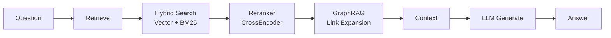

# ObsidianRAG 🧠

**Ask questions about your Obsidian notes using local AI**

[](https://www.python.org/)
[](https://github.com/Vasallo94/ObsidianRAG/actions)
[](LICENSE)
[](https://obsidian.md)

> 🎉 **v3 Now Available!** - Native Obsidian plugin with local AI. Install directly from Community Plugins.

A RAG (Retrieval-Augmented Generation) system for querying your Obsidian vault using **LangGraph** and **local LLMs** (Ollama). Get intelligent answers based on your personal knowledge base, with full privacy and offline capability.

---

## ✨ Key Features

- 🔌 **Native Obsidian Plugin** - Install with one click, no terminal required
- 🔒 **100% Local & Private** - All AI runs on your machine, zero cloud dependencies
- 🔍 **Advanced RAG** - Hybrid search (Vector + BM25) + CrossEncoder reranking
- 🕸️ **GraphRAG** - Follows `[[wikilinks]]` to expand context intelligently
- 🌍 **Multilingual** - Works in any language (Spanish, English, etc.)
- ⚡ **Real-time Streaming** - See answers generated token-by-token
- 📊 **Source Attribution** - Every answer shows relevance scores and links

---

## 📦 Installation

### For End Users (Recommended)

#### 1. Install the Obsidian Plugin

1. Open Obsidian → Settings → Community Plugins
2. Browse and search for "ObsidianRAG"
3. Click Install → Enable

#### 2. Install Backend

```bash
pip install obsidianrag
# or
pipx install obsidianrag
```

#### 3. Install Ollama

Download Ollama from [ollama.ai](https://ollama.ai/) and pull a model:

```bash
ollama pull gemma3
```

#### 4. Done!

Open the plugin from the ribbon icon (🧠) or command palette: `ObsidianRAG: Open Chat`

---

### For Developers

Clone and setup for development:

```bash
git clone https://github.com/Vasallo94/ObsidianRAG.git
cd ObsidianRAG

# Backend
cd backend
uv sync
uv run pytest

# Plugin
cd ../plugin
pnpm install
pnpm run dev
```

---

## 🚀 Quick Start

### Using the Plugin

1. **Start the backend server** (auto-starts if enabled in settings):
   - Command palette → `ObsidianRAG: Start Backend Server`
   - Or manually: `obsidianrag serve --vault /path/to/vault`

2. **Open the chat**:
   - Click the 🧠 icon in the ribbon, or
   - Command palette → `ObsidianRAG: Open Chat`

3. **Ask questions**:
   ```
   What notes do I have about Python?
   Summarize my meeting notes from this week
   What did I learn about machine learning?
   ```

4. **Get answers** with:
   - ✅ Answer text (with markdown formatting)
   - 📚 Source links to your notes
   - 🟢 Relevance scores (green = most relevant)

---

## ⚙️ Configuration

### Plugin Settings

Access via Settings → ObsidianRAG:

| Setting | Default | Description |
|---------|---------|-------------|
| **Server Port** | `8000` | Backend API port |
| **LLM Model** | `gemma3` | Ollama model (gemma3, qwen2.5, llama3.2, etc.) |
| **Auto-start Server** | `true` | Start backend when Obsidian opens |
| **Show Source Links** | `true` | Display note links in answers |

### Backend Configuration

The backend auto-configures from your vault, but you can customize via CLI:

```bash
obsidianrag serve --vault /path/to/vault --port 8000 --model qwen2.5
```

Or create `~/.config/obsidianrag/config.toml`:

```toml
llm_model = "qwen2.5"
use_reranker = true
retrieval_k = 12
```

---

## 🏗️ Architecture

### System Overview

```
┌─────────────────────────────────────────┐
│           Obsidian                      │
│  ┌────────────────────────────────┐     │
│  │   ObsidianRAG Plugin (TS)      │     │
│  │                                │     │
│  │  • Chat View                   │     │
│  │  • Server Manager              │     │
│  │  • Settings                    │     │
│  └──────────┬─────────────────────┘     │
└─────────────┼───────────────────────────┘
              │ HTTP (localhost:8000)
              ▼
┌─────────────────────────────────────────┐
│    Backend (Python)                     │
│                                         │
│  FastAPI → LangGraph → Ollama          │
│              ↓                          │
│        ChromaDB + Reranker              │
└─────────────────────────────────────────┘
```

### RAG Pipeline



**Retrieve Node**:
1. Hybrid search (60% vector, 40% BM25)
2. Reranking with BAAI/bge-reranker-v2-m3
3. GraphRAG expansion (follows `[[wikilinks]]`)
4. Score filtering (removes low-relevance < 0.3)

**Generate Node**:
1. Build prompt with context
2. Stream tokens from Ollama LLM
3. Return answer + sources

---

## 🤖 Supported Models

### LLMs (via Ollama)

| Model | Size | Best For | Install |
|-------|------|----------|---------|
| `gemma3` | 5GB | General use, balanced | `ollama pull gemma3` |
| `qwen2.5` | 4.4GB | Spanish, multilingual | `ollama pull qwen2.5` |
| `qwen3` | 5GB | Better reasoning | `ollama pull qwen3` |
| `llama3.2` | 2GB | Smaller, faster | `ollama pull llama3.2` |

### Embeddings

- **HuggingFace** (default): `paraphrase-multilingual-mpnet-base-v2` (auto-downloads)
- **Ollama** (optional): `nomic-embed-text` (`ollama pull nomic-embed-text`)

---

## 🔧 Troubleshooting

See [docs/TROUBLESHOOTING.md](docs/TROUBLESHOOTING.md) for detailed solutions.

### Quick Fixes

**❌ Server shows "Offline"**
```bash
# Make sure backend is installed
pip install obsidianrag

# Start manually
obsidianrag serve --vault /path/to/vault
```

**❌ "Ollama not running"**
```bash
# Make sure Ollama is running
ollama serve

# Verify
curl http://localhost:11434/api/tags
```

**❌ Model not found**
```bash
ollama pull gemma3
```

---

## 📂 Project Structure

```
ObsidianRAG/
├── backend/              # Python backend (PyPI package)
│   ├── obsidianrag/      # Main package
│   │   ├── api/          # FastAPI server
│   │   ├── cli/          # CLI commands
│   │   ├── core/         # RAG logic (LangGraph, ChromaDB)
│   │   └── config/       # Settings
│   └── tests/            # 77 tests
│
├── plugin/               # Obsidian plugin (TypeScript)
│   ├── src/main.ts       # Plugin entry point
│   ├── tests/            # 28 tests
│   └── styles.css        # UI styles
│
└── docs/                 # Documentation
```

---

## 🧪 Testing

```bash
# Backend tests (77 tests)
cd backend
uv run pytest

# Plugin tests (28 tests)
cd plugin
pnpm test
```

**Coverage**:
- Backend: 42% (focus on core logic)
- Plugin: Unit tests for HTTP/parsing/settings

---

## 🤝 Contributing

We welcome contributions!

1. Fork the repo
2. Create a feature branch: `git checkout -b feature/awesome-feature`
3. Commit changes: `git commit -m 'feat: add awesome feature'`
4. Push: `git push origin feature/awesome-feature`
5. Open a Pull Request

See [docs/CONTRIBUTING.md](docs/CONTRIBUTING.md) for detailed guidelines.

---

## 📄 License

MIT License - see [LICENSE](LICENSE)

---

## 🙏 Acknowledgments

- [LangChain](https://github.com/langchain-ai/langchain) & [LangGraph](https://github.com/langchain-ai/langgraph) - RAG framework
- [Ollama](https://ollama.ai/) - Local LLM runtime
- [Obsidian](https://obsidian.md/) - Note-taking app
- [ChromaDB](https://www.trychroma.com/) - Vector database

---

<p align="center">
  Made with ❤️ for the Obsidian community<br/>
  🌟 Star us on <a href="https://github.com/Vasallo94/ObsidianRAG">GitHub</a>
</p>
