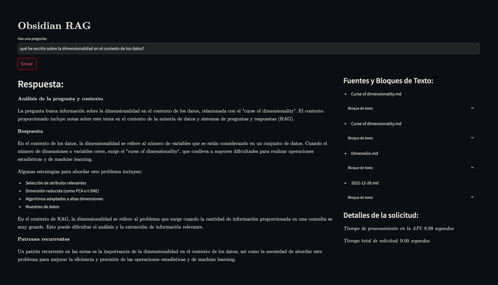
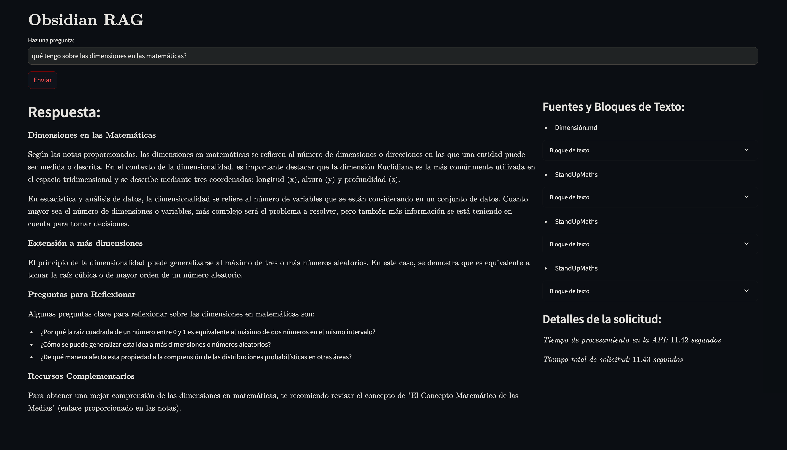
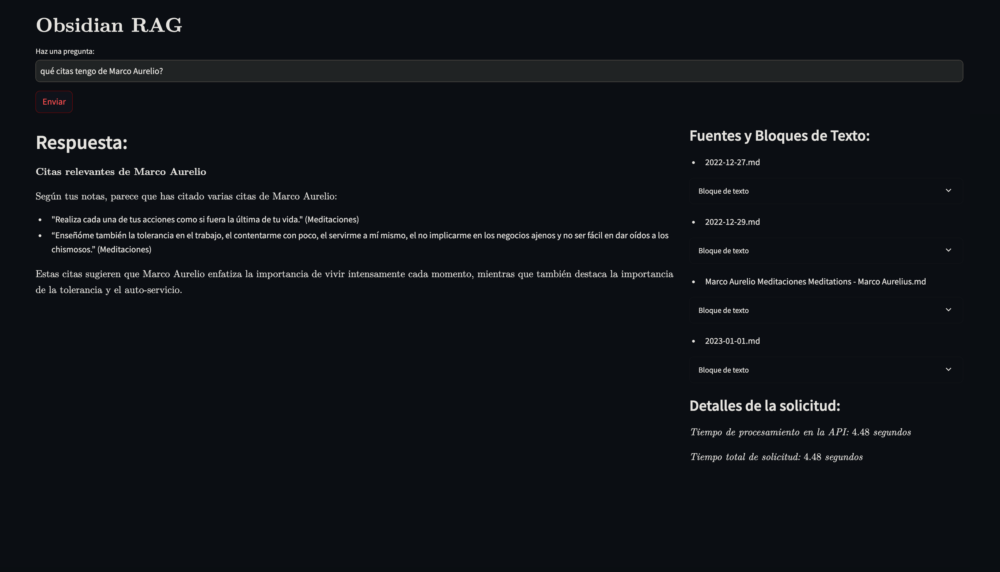

# Obsidian RAG Project

## Description
Obsidian RAG (Retrieval-Augmented Generation) is designed to query notes stored in Obsidian with a local language model (LLAMA3.2). It uses a LangChain-based pipeline to load, split, and query documents from Obsidian, along with a FastAPI service for model interaction and a Streamlit interface for displaying queries and responses.

## Components
- **cerebro.py**: FastAPI service that manages document loading, vector database creation, language model configuration, and the retrieval and response chain. It exposes an endpoint for asking questions and getting context-aware answers.
- **app.py**: Streamlit-based graphical interface for interacting with the API and displaying user query responses.

## Installation
Clone the repository:
```sh
git clone <https://github.com/Vasallo94/ObsidianLangchain.git>
cd <PROJECT_DIRECTORY>
```
Create a virtual environment and activate it:
```sh
python -m venv venv
source venv/bin/activate  # On Windows: venv\Scripts\activate
```
Install the dependencies:
```sh
pip install -r requirements.txt
```

## Configuration
1. Install Ollama and the LLAMA3.2 model
   To use the LLAMA3.2 language model, follow these steps:
   - Install Ollama:
     Ollama is a platform for managing and running language models locally. To install Ollama:

     Download Ollama:

     Visit [OLLAMA](https://ollama.com) and download the appropriate version for your operating system (Mac).
     Install Ollama:

     Once downloaded, open the downloaded file and follow the installation instructions.
     Verify the Installation:

     Open a terminal and run:
     ```sh
     ollama --version
     ```
     You should see the installed version of Ollama.
   - Download and Install the LLAMA3.2 Model
     Log in to Ollama:

     In the terminal, run:
     ```sh
     ollama
     ```
     You will see a response with available comands.
     Download the LLAMA3.2 Model:

     In the terminal, run:
     ```sh
     ollama run llama3.2
     ```
     Run the following command to start the model; if you don't have it, it will be downloaded automatically.
     Wait for the model download and installation to complete.

     List the installed models with:
     ```sh
     ollama list
     ```

2. Create a .env file in the project's root directory and add the path to your Obsidian vault:
```sh
OBSIDIAN_PATH = /path/to/your/obsidian/vault
```

## Usage
- **Run the API**  
  To start the API, run the following command:
  ```sh
  python cerebro.py
  ```
  The API will be available at http://localhost:8000.
- **Run the UI**  
  To start the graphical interface, run the following command:
  ```sh
  streamlit run app.py
  ```
  The Streamlit application will be available at http://localhost:8501.
- **Ask Questions**  
  - From the user interface (Streamlit): Enter your question in the text field and click "Submit" to get a response.
  - From the API: Send a POST request to http://localhost:8000/ask with a JSON containing the question:
  ```json
  {
      "text": "What do you think about infinity?"
  }
  ```
  The response will be a JSON with the generated answer, information sources, and text blocks used.

### What Can You Ask?
You can query your Obsidian notes for:
- Summaries of content across multiple notes.
- Specific information stored in your notes.
- Context-aware responses combining multiple sources.

## Interface Preview





## Swagger
The FastAPI includes a Swagger interface that you can use to test endpoints and view documentation. Visit http://localhost:8000/docs to access Swagger.

## Contributing
If you wish to contribute to the project, please open an issue or submit a pull request. Make sure to follow best practices and provide a clear description of the changes made.

## Future Improvements
- Add support for multiple language models.
- Implement a more efficient document retrieval system.
- Implemeent a reranker for better response selection.
- and more...

## License
This project is licensed under the MIT License. See the LICENSE file for more information.


## File Structure
.
├── app.py                # Streamlit interface
├── cerebro.py            # FastAPI backend
├── db/                   # Vector database for document retrieval
├── services/             # Core services for QA and database handling
├── utils/                # Utility functions and logging
├── requirements.txt      # Python dependencies
└── README.md             # Project documentation
