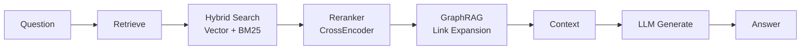

# ObsidianRAG

**Ask questions about your Obsidian notes using local AI**

[](https://github.com/Vasallo94/ObsidianRAG/stargazers)
[](https://pypi.org/project/obsidianrag/)
[](https://github.com/Vasallo94/ObsidianRAG/actions/workflows/test-backend.yml)
[](LICENSE)
[](https://www.python.org/)
[](https://obsidian.md)
[](https://ghcr.io/vasallo94/obsidianrag-backend)

A RAG (Retrieval-Augmented Generation) system for querying your Obsidian vault using **LangGraph** and **local LLMs**. Supports **Ollama**, **LM Studio**, and any **OpenAI-compatible** server. All processing runs on your machine — fully private, fully offline.

---

## Features

- **Native Obsidian Plugin** — Install and use directly inside Obsidian, no terminal required
- **100% Local and Private** — All AI runs on your machine, zero cloud dependencies
- **Multi-Provider Support** — Works with Ollama, LM Studio, or any OpenAI-compatible API
- **Advanced RAG Pipeline** — Hybrid search (Vector + BM25) with CrossEncoder reranking
- **GraphRAG** — Follows `[[wikilinks]]` to expand context from linked notes
- **Multilingual** — Responds in the same language as your question
- **Real-time Streaming** — Token-by-token answer generation
- **Source Attribution** — Every answer includes relevance scores and links to source notes
- **Docker Support** — One-command deployment with docker-compose
- **Incremental Indexing** — Only re-indexes changed files, not the entire vault

---

## Quick Start

### Option A: Obsidian Plugin (Recommended)

1. **Install the plugin**

   Open Obsidian > Settings > Community Plugins > Browse > search "Vault RAG" > Install > Enable

   > The plugin is pending Community Plugins approval. For now, install manually from [GitHub Releases](https://github.com/Vasallo94/ObsidianRAG/releases).

2. **Install the backend**

   ```bash
   uv add obsidianrag
   ```

3. **Install Ollama** and pull a model

   Download from [ollama.ai](https://ollama.ai/), then:

   ```bash
   ollama pull gemma3
   ```

4. **Open the chat** from the ribbon icon or command palette: `ObsidianRAG: Open Chat`

### Option B: Docker

```bash
OBSIDIAN_VAULT_PATH=/path/to/your/vault docker compose up
```

Requires Ollama running on the host. See the [Docker section](#docker-deployment) for details.

### Option C: Development Setup

```bash
git clone https://github.com/Vasallo94/ObsidianRAG.git
cd ObsidianRAG

# Backend
cd backend
uv sync
uv run pytest

# Plugin
cd ../plugin
pnpm install
pnpm run dev
```

---

## LLM Providers

ObsidianRAG supports multiple local LLM runtimes:

| Provider | CLI Flag | Default URL | API Format |
|----------|----------|-------------|------------|
| **Ollama** | `--provider ollama` | `http://localhost:11434` | Ollama native |
| **LM Studio** | `--provider lmstudio` | `http://localhost:1234/v1` | Chat Completions |
| **Custom** | `--provider custom` | (must specify) | Ollama or Chat Completions |

Examples:

```bash
# Ollama (default)
obsidianrag serve --vault /path/to/vault

# LM Studio
obsidianrag serve --vault /path/to/vault --provider lmstudio --model my-model

# Custom OpenAI-compatible server
obsidianrag serve --vault /path/to/vault --provider custom \
  --base-url http://my-server:8080/v1 \
  --api-format chat-completions \
  --api-key my-key
```

---

## Configuration

### Plugin Settings

Access via Settings > ObsidianRAG:

| Setting | Default | Description |
|---------|---------|-------------|
| **Backend command** | `obsidianrag` | Command to start the backend |
| **Server port** | `8000` | Backend API port |
| **LLM provider** | `Ollama` | Runtime: Ollama, LM Studio, or Custom |
| **LLM base URL** | `http://localhost:11434` | Provider endpoint |
| **LLM model** | `gemma3` | Model for answer generation |
| **API key** | — | Required only for some custom providers |
| **Use reranker** | `true` | CrossEncoder reranking for better relevance |
| **Auto-start server** | `true` | Start backend when Obsidian opens |
| **Show source links** | `true` | Display note links in answers |

### CLI Reference

```
obsidianrag serve [OPTIONS]

Options:
  --vault, -v       Path to Obsidian vault (required)
  --host, -h        Host to bind to (default: 127.0.0.1)
  --port, -p        Server port (default: 8000)
  --provider        LLM provider: ollama, lmstudio, custom
  --model, -m       LLM model name (default: gemma3)
  --base-url        Base URL for the selected provider
  --api-format      API format: ollama or chat-completions
  --api-key         API key for providers that require one
  --reranker        Enable reranker (default)
  --no-reranker     Disable reranker
  --reload, -r      Enable auto-reload for development
```

### Environment Variables

All backend settings can be set via environment variables with the `OBSIDIANRAG_` prefix. See [`.env.example`](.env.example) for the full list.

Key variables:

```bash
OBSIDIANRAG_OBSIDIAN_PATH=/path/to/vault
OBSIDIANRAG_LLM_PROVIDER=ollama
OBSIDIANRAG_LLM_MODEL=gemma3
OBSIDIANRAG_OLLAMA_BASE_URL=http://localhost:11434
```

---

## Architecture

### System Overview

```
+-------------------------------------------+
|             Obsidian                       |
|  +-------------------------------------+  |
|  |   ObsidianRAG Plugin (TypeScript)   |  |
|  |                                     |  |
|  |  - Chat UI                          |  |
|  |  - Server Manager                   |  |
|  |  - Provider Settings                |  |
|  +----------------+--------------------+  |
+-------------------|------------------------+
                    | HTTP (localhost:8000)
                    v
+-------------------------------------------+
|   Backend (Python / FastAPI)              |
|                                           |
|   LLM Provider Layer                      |
|   (Ollama | LM Studio | Custom)          |
|        |                                  |
|   LangGraph Agent                         |
|   Retrieve -> Rerank -> Generate          |
|        |                                  |
|   ChromaDB (Vector Store)                 |
+-------------------------------------------+
```

### RAG Pipeline


```mermaid
flowchart LR
    Q[Question] --> R[Retrieve]
    R --> H[Hybrid Search<br/>Vector + BM25]
    H --> RR[Reranker<br/>CrossEncoder]
    RR --> G[GraphRAG<br/>Link Expansion]
    G --> C[Context]
    C --> L[LLM Generate]
    L --> A[Answer]
```

**Retrieve Node:**
1. Hybrid search (60% vector similarity, 40% BM25 keyword matching)
2. Reranking with BAAI/bge-reranker-v2-m3
3. GraphRAG expansion via `[[wikilinks]]`
4. Score filtering (removes documents below 0.3 relevance)

**Generate Node:**
1. Build prompt with retrieved context
2. Stream tokens from the configured LLM
3. Return answer with source documents and scores

---

## Supported Models

### LLMs

Any model available in your configured provider. Recommended options for Ollama:

| Model | Size | Best For | Install |
|-------|------|----------|---------|
| `gemma3` | 5 GB | General use, balanced | `ollama pull gemma3` |
| `qwen2.5` | 4.4 GB | Spanish, multilingual | `ollama pull qwen2.5` |
| `qwen3` | 5 GB | Better reasoning | `ollama pull qwen3` |
| `llama3.2` | 2 GB | Smaller, faster | `ollama pull llama3.2` |

### Embeddings

| Provider | Model | Notes |
|----------|-------|-------|
| **Ollama** (default) | `qwen3-embedding` | Recommended. Auto-downloaded on first run. |
| **HuggingFace** | `paraphrase-multilingual-mpnet-base-v2` | Alternative. Set `OBSIDIANRAG_EMBEDDING_PROVIDER=huggingface`. |

---

## Docker Deployment

### Basic Usage

```bash
# Pull the pre-built image and start
OBSIDIAN_VAULT_PATH=/path/to/your/vault docker compose up

# Or build locally
OBSIDIAN_VAULT_PATH=/path/to/your/vault docker compose up --build
```

The pre-built image is published to `ghcr.io/vasallo94/obsidianrag-backend:latest` on every push to main.

### Requirements

- Docker or Podman with compose support
- Ollama running on the host machine

### Configuration

Set these in your environment or in a `.env` file:

| Variable | Required | Description |
|----------|----------|-------------|
| `OBSIDIAN_VAULT_PATH` | Yes | Host path to your Obsidian vault |
| `LLM_MODEL` | No | Model name (default: `gemma3`) |

The container connects to the host's Ollama instance via `host.docker.internal`. The HuggingFace model cache is persisted in a named volume to avoid re-downloading on container restarts.

### Security

The Docker setup includes:
- `no-new-privileges` security option
- 4 GB memory limit
- Health check on `/health` endpoint
- Non-root user (`appuser`)

---

## Troubleshooting

**Server shows "Offline"**
```bash
uv add obsidianrag
obsidianrag serve --vault /path/to/vault
```

**"Ollama not running"**
```bash
ollama serve
curl http://localhost:11434/api/tags
```

**Model not found**
```bash
ollama pull gemma3
```

See [docs/TROUBLESHOOTING.md](docs/TROUBLESHOOTING.md) for more solutions.

---

## Project Structure

```
ObsidianRAG/
|-- backend/                  Python backend (PyPI package)
|   |-- obsidianrag/
|   |   |-- api/              FastAPI server
|   |   |-- cli/              CLI commands
|   |   |-- core/             RAG logic
|   |   |   |-- qa_agent.py       LangGraph agent
|   |   |   |-- qa_service.py     Retrieval and reranking
|   |   |   |-- db_service.py     ChromaDB management
|   |   |   |-- llm_provider.py   Multi-provider LLM support
|   |   |   `-- metadata_tracker.py  Incremental indexing
|   |   `-- config.py         Pydantic settings
|   |-- tests/
|   |-- Dockerfile            Multi-stage build
|   `-- pyproject.toml
|
|-- plugin/                   Obsidian plugin (TypeScript)
|   |-- src/main.ts           Plugin entry point
|   |-- tests/                Unit tests
|   `-- styles.css            UI styles
|
|-- docker-compose.yml        Container orchestration
|-- .env.example              Configuration template
`-- docs/                     Documentation
```

---

## Testing

```bash
# Backend
cd backend
uv run pytest

# Plugin
cd plugin
pnpm test
```

---

## Contributing

Contributions are welcome. See [docs/CONTRIBUTING.md](docs/CONTRIBUTING.md) for guidelines.

1. Fork the repository
2. Create a feature branch: `git checkout -b feature/your-feature`
3. Commit changes: `git commit -m 'feat: add your feature'`
4. Push: `git push origin feature/your-feature`
5. Open a Pull Request

---

## License

MIT License. See [LICENSE](LICENSE).

---

## Acknowledgments

- [LangChain](https://github.com/langchain-ai/langchain) and [LangGraph](https://github.com/langchain-ai/langgraph) — RAG framework
- [Ollama](https://ollama.ai/) — Local LLM runtime
- [Obsidian](https://obsidian.md/) — Note-taking application
- [ChromaDB](https://www.trychroma.com/) — Vector database
