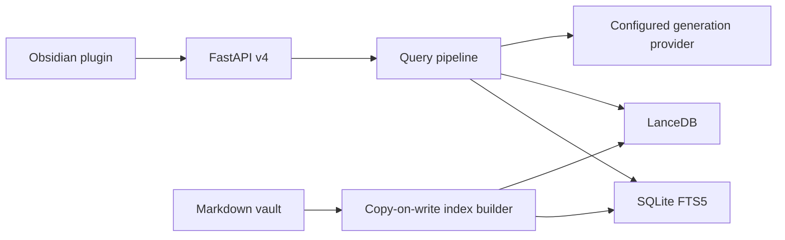

# ObsidianRAG

**Ask questions about your Obsidian notes with a local-first hybrid RAG index.**

[](https://pypi.org/project/obsidianrag/)
[](https://github.com/Vasallo94/ObsidianRAG/actions/workflows/test-backend.yml)
[](LICENSE)

ObsidianRAG 4 uses SQLite FTS5 and embedded LanceDB as its only retrieval engine. The Obsidian plugin manages the backend, index lifecycle, chat, and source links. Generation supports Ollama, LM Studio, and OpenAI-compatible servers.

## Highlights

- Incremental copy-on-write index revisions
- Hybrid lexical and vector retrieval
- Grounded answers with numeric source citations
- Explicit Build, Refresh, Full rebuild, and Prune controls
- Reader leases that protect in-flight queries during refreshes
- Safe regular-Markdown scanning without following links
- API 4 compatibility checks between plugin and backend
- No shell invocation when the plugin starts the backend

## Install

Install the backend:

```bash
uv tool install obsidianrag==4.0.0
```

Install the plugin assets from the `plugin-v4.0.0` GitHub release:

- `main.js`
- `manifest.json`
- `styles.css`

Place them in `<vault>/.obsidian/plugins/vault-rag/`, then enable **Vault RAG** in Obsidian.

## First run

1. Start your generation provider and make the configured model available.
2. Open **Vault RAG settings** and confirm the backend executable, usually `obsidianrag` (`obsidianrag.exe` on Windows).
3. Start the backend.
4. Select **Build index**.
5. Open the chat view.

The backend never indexes automatically at startup.

## CLI

```bash
# Start API 4
obsidianrag serve --vault /path/to/vault

# Build or incrementally refresh
obsidianrag index --vault /path/to/vault

# Rebuild after incompatible embedding or chunk settings
obsidianrag index --vault /path/to/vault --full-rebuild

# Inspect and clean revisions
obsidianrag status --vault /path/to/vault
obsidianrag prune --vault /path/to/vault

# Retrieve without generation
obsidianrag search "deployment rollback" --vault /path/to/vault
obsidianrag search "deployment rollback" --vault /path/to/vault --lexical-only

# Ask through the v4 hybrid pipeline
obsidianrag ask "How do I roll back a deployment?" --vault /path/to/vault
```

## Providers

| Provider | Flag | Default URL | API format |
|---|---|---|---|
| Ollama | `--provider ollama` | `http://localhost:11434` | Ollama |
| LM Studio | `--provider lmstudio` | `http://localhost:1234/v1` | Chat completions |
| Custom | `--provider custom` | configured by user | Ollama or chat completions |

Examples:

```bash
obsidianrag serve --vault /path/to/vault --provider ollama --model gemma3

obsidianrag serve --vault /path/to/vault \
  --provider lmstudio --model local-model \
  --base-url http://localhost:1234/v1
```

API keys configured in the plugin are session-only and are passed through the backend process environment, not command arguments.

## Index architecture


```mermaid
flowchart LR
    Plugin[Obsidian plugin] --> API[FastAPI v4]
    API --> Pipeline[Query pipeline]
    Pipeline --> FTS[SQLite FTS5]
    Pipeline --> Vector[LanceDB]
    Pipeline --> LLM[Configured generation provider]
    Vault[Markdown vault] --> Builder[Copy-on-write index builder]
    Builder --> FTS
    Builder --> Vector
```

Revisions live under:

```text
.obsidianrag/v4/
├── active.json
├── build.lock
├── indexes/<revision>/
└── leases/<revision>/
```

A refresh scans regular Markdown files, hashes note content, reuses unchanged vectors in bounded batches, and embeds only changed notes. A candidate revision activates only after SQLite, FTS5, deterministic IDs, paths, vector dimensions, and finite vector values validate successfully.

Readers lease their current revision. A new revision may activate while old requests finish; inactive leased revisions cannot be pruned.

## API 4

| Endpoint | Purpose |
|---|---|
| `GET /capabilities` | Exact plugin/backend protocol contract |
| `GET /health` | Process liveness and query readiness |
| `GET /models` | Models exposed by the configured provider |
| `POST /ask` | Complete grounded answer |
| `POST /ask/stream` | SSE answer stream |
| `GET /index/status` | Missing/current/stale/rebuild-required state |
| `POST /index/build` | Incremental build or explicit full rebuild |
| `POST /index/prune` | Remove unleased inactive revisions |

API 3 clients and backends are intentionally incompatible with 4.0.0.

## Migration from 3.x

- Install backend and plugin 4.0.0 together.
- Existing `.obsidianrag/v4` revisions are reused when compatible.
- Legacy `.obsidianrag/db` Chroma data is ignored and never deleted automatically.
- Replace compound backend commands such as `uv run obsidianrag` with an executable path or name.
- Build the v4 index explicitly if no compatible revision exists.
- Remove legacy index data manually only after validating 4.0.0.

## Development

```bash
git clone https://github.com/Vasallo94/ObsidianRAG.git
cd ObsidianRAG

cd backend
uv sync --locked --dev
uv run pytest
uv run ruff check .
uv run mypy .

cd ../plugin
pnpm install --frozen-lockfile
pnpm test
pnpm run lint
pnpm run build
```

Tests use temporary fixture vaults. Integration tests requiring a real provider are excluded from normal CI.

## Release

Backend and plugin share version `4.0.0` but publish independently:

1. Tag `backend-v4.0.0` and verify PyPI.
2. Tag `plugin-v4.0.0` and verify GitHub release assets.

## License

MIT. See [LICENSE](LICENSE).
