# ObsidianRAG 🧠

A RAG (Retrieval-Augmented Generation) system for querying your Obsidian notes using **LangGraph** and **local LLMs** with Ollama. Ask questions in natural language and get answers based on your personal knowledge.


<p align="center">
  
</p>

---

## 📋 Table of Contents

- [Features](#-features)
- [Prerequisites](#-prerequisites)
- [Quick Installation](#-quick-installation)
- [Configuration](#-configuration)
- [Usage](#-usage)
- [Architecture](#-architecture)
- [Available Models](#-available-models)
- [Troubleshooting](#-troubleshooting)
- [Contributing](#-contributing)

---

## ✨ Features

### 🔍 Advanced Hybrid Search
- **Vector + BM25**: Combines semantic embeddings with lexical search
- **CrossEncoder Reranker**: BAAI/bge-reranker-v2-m3 for relevance reordering
- **GraphRAG**: Context expansion following Obsidian `[[wikilinks]]`

### 🤖 LLM Integration
- **100% Local**: Everything runs on your machine, no data sent to the cloud
- **Multiple models**: Supports gemma3, qwen2.5, qwen3, deepseek-r1, and more
- **Smart fallback**: If a model is not available, automatically uses alternatives

### 📊 Analytics & Metrics
- **Relevance scores**: Each source shows its reranker score (0-100%)
- **Detailed logging**: Complete traceability of each query
- **Incremental indexing**: Only processes modified notes

### 🌍 Multilingual Support
- **Automatic language detection**: Responds in the dominant language between your question and notes
- **Works with any language**: Spanish, English, Portuguese, etc.

---

## 📦 Prerequisites

### 1. Python 3.11+

```bash
# Check version
python --version  # Must be 3.11 or higher
```

### 2. Ollama

Ollama is the local LLM engine. Install from [ollama.ai](https://ollama.ai/):

```bash
# macOS
brew install ollama

# Linux
curl -fsSL https://ollama.com/install.sh | sh

# Windows
# Download from https://ollama.com/download
```

Verify it works:
```bash
ollama --version
```

### 3. UV (Recommended package manager)

```bash
# macOS/Linux
curl -LsSf https://astral.sh/uv/install.sh | sh

# Or with pip
pip install uv
```

---

## 🚀 Quick Installation

### Option A: One-Command Installation (Recommended)

```bash
git clone https://github.com/Vasallo94/ObsidianRAG.git
cd ObsidianRAG
chmod +x install.sh && ./install.sh
```

### Option B: Manual Installation

#### Step 1: Clone the repository

```bash
git clone https://github.com/Vasallo94/ObsidianRAG.git
cd ObsidianRAG
```

#### Step 2: Install dependencies

```bash
uv sync
```

#### Step 3: Configure environment variables

```bash
# Copy template
cp .env.example .env

# Edit with your favorite editor
nano .env  # or code .env, vim .env, etc.
```

**Minimum `.env` content:**
```env
# REQUIRED: Path to your Obsidian vault
OBSIDIAN_PATH=/Users/your_user/Documents/ObsidianVault

# OPTIONAL: LLM model (default: gemma3)
LLM_MODEL=gemma3
```

#### Step 4: Download Ollama models

```bash
# Start Ollama (if not running)
ollama serve &

# Download LLM model (choose one)
ollama pull gemma3      # Recommended, balanced
ollama pull qwen2.5     # Good for Spanish
ollama pull qwen3       # Better reasoning
ollama pull deepseek-r1 # Advanced reasoning

# OPTIONAL: Ollama embeddings model
ollama pull embeddinggemma  # 622MB, multilingual
```

> **Note**: If you don't download `embeddinggemma`, the system will automatically use HuggingFace embeddings (downloaded automatically on first run).

#### Step 5: Start the server

```bash
uv run main.py
```

You should see:
```
INFO - ✅ Application started successfully
INFO - Uvicorn running on http://0.0.0.0:8000
```

#### Step 6: Open the web interface

```bash
# In another terminal
uv run streamlit run streamlit_app.py
```

Open your browser at: **http://localhost:8501**

---

## ⚙️ Configuration

### Complete Environment Variables

Create a `.env` file in the project root:

```env
# ============ REQUIRED ============
OBSIDIAN_PATH=/path/to/your/vault

# ============ MODELS ============
# LLM (gemma3, qwen2.5, qwen3, deepseek-r1)
LLM_MODEL=gemma3

# Embeddings: 'ollama' or 'huggingface'
EMBEDDING_PROVIDER=huggingface
OLLAMA_EMBEDDING_MODEL=embeddinggemma

# If using HuggingFace (automatic fallback)
EMBEDDING_MODEL=sentence-transformers/paraphrase-multilingual-mpnet-base-v2

# ============ RERANKER ============
USE_RERANKER=true
RERANKER_MODEL=BAAI/bge-reranker-v2-m3
RERANKER_TOP_N=6

# ============ RETRIEVAL ============
CHUNK_SIZE=1500
CHUNK_OVERLAP=300
RETRIEVAL_K=12
BM25_K=5
BM25_WEIGHT=0.4
VECTOR_WEIGHT=0.6

# ============ API ============
API_HOST=0.0.0.0
API_PORT=8000
```

### .env.example File

The project includes a `.env.example` with all default values.

---

## 📖 Usage

### Web Interface (Recommended)

1. Start the server: `uv run main.py`
2. Start the UI: `uv run streamlit run streamlit_app.py`
3. Open http://localhost:8501
4. Ask questions about your notes!

**UI Features:**
- 🤖 System status display in sidebar
- 📚 Sources with relevance scores
- 🔄 Reindex database button
- 🗑️ Clear chat button

### REST API

```bash
# Ask a question
curl -X POST http://localhost:8000/ask \
  -H "Content-Type: application/json" \
  -d '{"text": "What notes do I have about Python?"}'

# Check status
curl http://localhost:8000/health

# Get statistics
curl http://localhost:8000/stats

# Force reindex
curl -X POST http://localhost:8000/rebuild_db
```

### API Response

```json
{
  "question": "What notes do I have about Python?",
  "result": "According to your notes, you have documentation about...",
  "sources": [
    {
      "source": "Programming/Python Basics.md",
      "score": 0.92,
      "retrieval_type": "retrieved"
    },
    {
      "source": "Programming/Django Tutorial.md", 
      "score": 0.78,
      "retrieval_type": "graphrag_link"
    }
  ],
  "process_time": 2.5,
  "session_id": "abc123..."
}
```

---

## 🏗️ Architecture

### System Overview

```mermaid
flowchart TB
    subgraph Frontend["🖥️ Frontend"]
        UI["Streamlit<br/>Web Interface"]
    end
    
    subgraph Backend["⚙️ Backend"]
        API["FastAPI<br/>(main.py)"]
        Agent["LangGraph Agent"]
    end
    
    subgraph Retrieval["🔍 Retrieval Layer"]
        Ensemble["EnsembleRetriever"]
        Vector["Vector Search<br/>(ChromaDB)"]
        BM25["BM25 Search"]
        Reranker["CrossEncoder<br/>Reranker"]
    end
    
    subgraph LLM["🤖 LLM Layer"]
        Ollama["Ollama<br/>(gemma3, qwen2.5, etc.)"]
    end
    
    subgraph Storage["💾 Storage"]
        ChromaDB[(ChromaDB<br/>Vector Store)]
        Obsidian[("📁 Obsidian<br/>Vault")]
    end
    
    UI -->|HTTP POST /ask| API
    API --> Agent
    Agent --> Ensemble
    Ensemble --> Vector
    Ensemble --> BM25
    Vector --> Reranker
    BM25 --> Reranker
    Reranker --> Agent
    Agent --> Ollama
    Ollama --> Agent
    Agent -->|Response| API
    API -->|JSON| UI
    
    ChromaDB --> Vector
    Obsidian -->|Index| ChromaDB
```



### LangGraph Agent Flow

The agent uses a simple but powerful two-node graph:


### Retrieval Pipeline Detail


### Data Flow

1. **User** asks question → **Streamlit**
2. **Streamlit** → POST `/ask` → **FastAPI**
3. **FastAPI** → invokes → **LangGraph Agent**
4. **Retrieve Node**:
   - Hybrid search (Vector + BM25)
   - Reranking with CrossEncoder
   - GraphRAG expansion (follows [[links]])
5. **Generate Node**:
   - Builds prompt with context
   - Invokes LLM (Ollama)
6. **Response** → FastAPI → Streamlit → User

### Agent State


---

## 🤖 Available Models

### LLMs (Ollama)

| Model | Size | Description | Command |
|-------|------|-------------|---------|
| `gemma3` | 5GB | Balanced, good for everything | `ollama pull gemma3` |
| `qwen2.5` | 4.4GB | Excellent for Spanish | `ollama pull qwen2.5` |
| `qwen3` | 5GB | Better reasoning | `ollama pull qwen3` |
| `deepseek-r1` | 4.7GB | Advanced reasoning | `ollama pull deepseek-r1` |

### Embeddings

| Model | Provider | Size | Description |
|-------|----------|------|-------------|
| `embeddinggemma` | Ollama | 622MB | 100+ languages, fast |
| `paraphrase-multilingual-mpnet` | HuggingFace | 420MB | Automatic fallback |

> **Tip**: The system automatically falls back to HuggingFace if the Ollama model is not available.

---

## 🔧 Troubleshooting

### ❌ "Ollama not available" / Connection refused

```bash
# 1. Verify Ollama is running
ollama serve

# 2. On macOS, it might be running as an app
# Open Ollama.app from Applications

# 3. Verify with
curl http://localhost:11434/api/tags
```

### ❌ "Model not found"

```bash
# Download the model you need
ollama pull gemma3
ollama pull embeddinggemma  # For embeddings
```

### ❌ "Collection does not exist" / Corrupt DB

```bash
# Delete and rebuild the database
rm -rf db/
uv run main.py
```

### ❌ First run very slow

This is normal. The first time:
1. Downloads HuggingFace models (reranker, embeddings)
2. Indexes all your Obsidian notes
3. Creates the vector database

Subsequent runs are much faster (incremental indexing).

### ❌ "No results found"

1. Verify `OBSIDIAN_PATH` points to your vault
2. Make sure you have `.md` files in the vault
3. Reindex: `rm -rf db/ && uv run main.py`

### ❌ Responses in wrong language

The agent responds in the dominant language between your question and your notes content. If most of your notes are in Spanish and you ask in English, you'll get Spanish responses.

Try `qwen2.5` for better Spanish support:
```bash
ollama pull qwen2.5
```

---

## 📂 Project Structure

```
ObsidianRAG/
├── main.py                 # 🧠 FastAPI server (entry point)
├── streamlit_app.py        # 🖥️ Streamlit interface
├── install.sh              # 📦 One-command installation script
├── config/
│   └── settings.py         # ⚙️ Pydantic configuration
├── services/
│   ├── qa_agent.py         # 🤖 LangGraph agent (retrieve→generate)
│   ├── qa_service.py       # 🔍 Hybrid retriever + reranker
│   ├── db_service.py       # 💾 ChromaDB + indexing
│   └── metadata_tracker.py # 📊 Change detection
├── utils/
│   └── logger.py           # 📝 Logging configuration
├── scripts/
│   ├── debug/              # 🐛 Debug utilities
│   └── tests/              # 🧪 Integration tests
├── assets/
│   └── styles.css          # 🎨 UI styles
├── db/                     # 💽 ChromaDB database (auto-generated)
├── logs/                   # 📋 Execution logs
├── .env                    # 🔐 Environment variables (create from .env.example)
└── .env.example            # 📄 Configuration template
```

---

## 🤝 Contributing

Contributions are welcome!

1. Fork the repository
2. Create a branch: `git checkout -b feature/new-feature`
3. Commit: `git commit -m 'feat: add new feature'`
4. Push: `git push origin feature/new-feature`
5. Open a Pull Request

---

## 📄 License

MIT License - see [LICENSE](LICENSE)

---


<p align="center">
  Made with ❤️ for the Obsidian community
</p>
