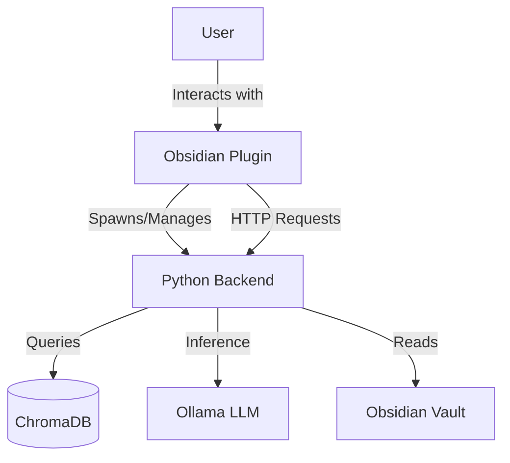
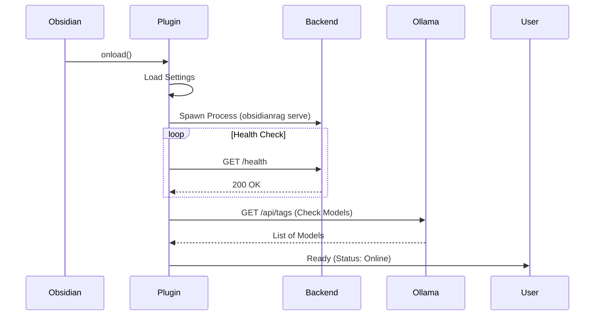
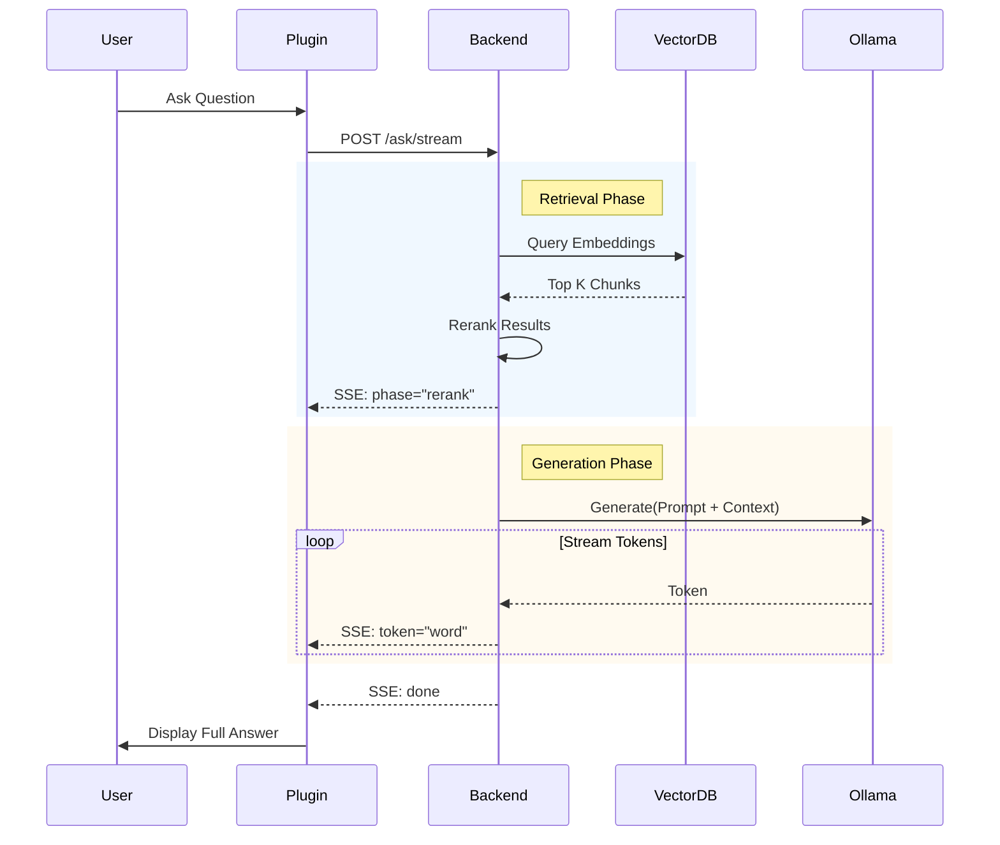
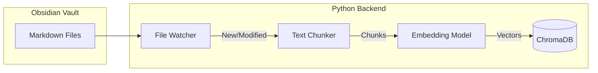

# ObsidianRAG Architecture

This document describes the high-level architecture of ObsidianRAG v3, which consists of a TypeScript plugin for Obsidian and a Python backend for RAG capabilities.

## High-Level Overview

## Component Interaction

### 1. Startup Flow

### 2. RAG Query Flow (Streaming)

## Data Flow

