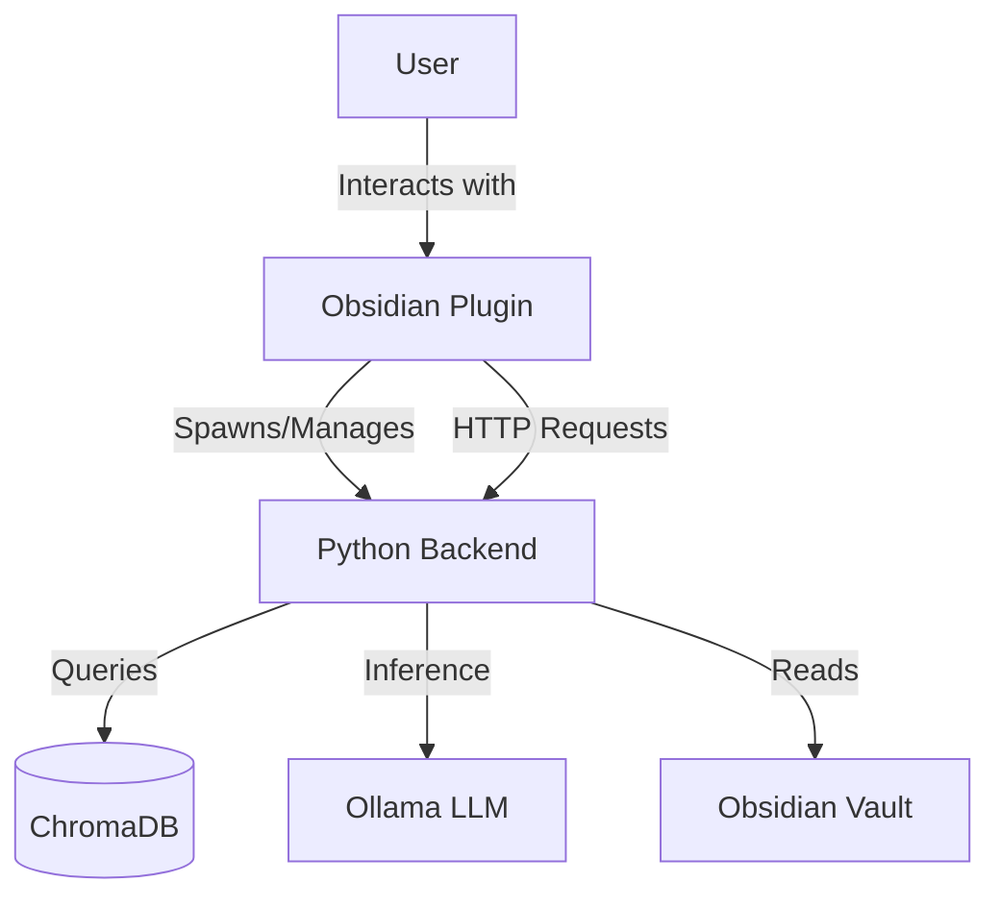
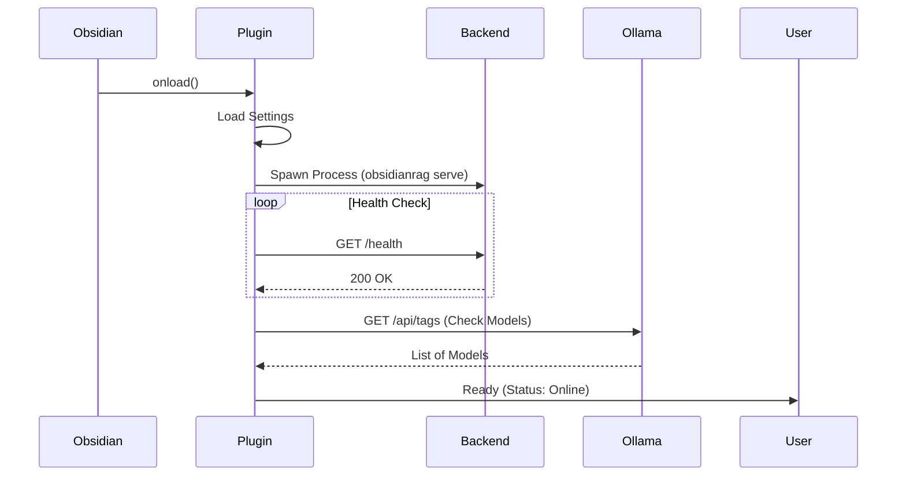
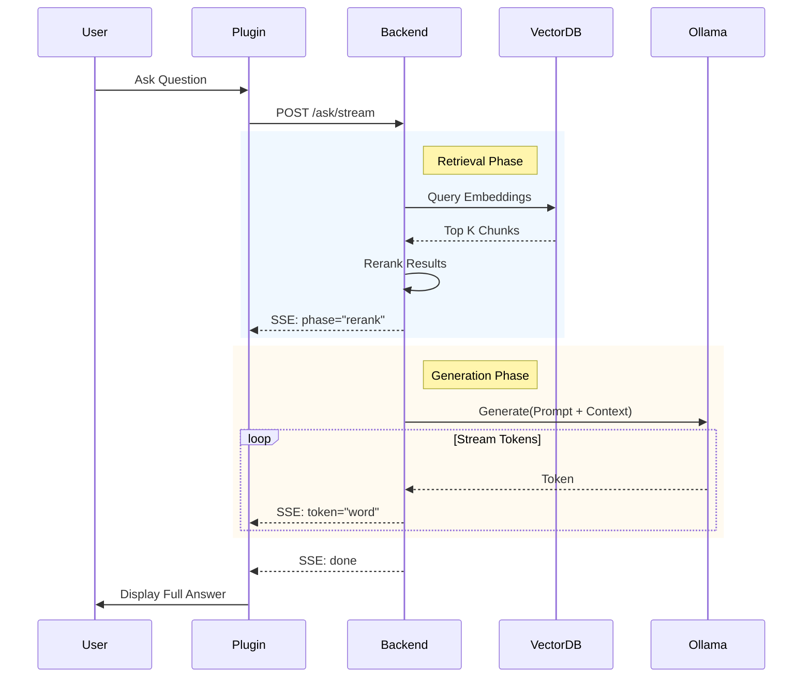
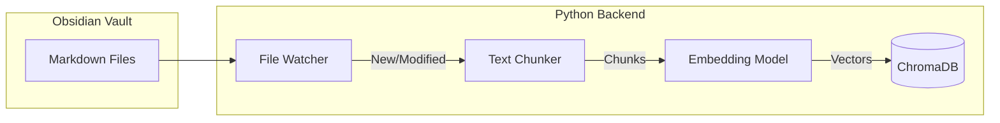
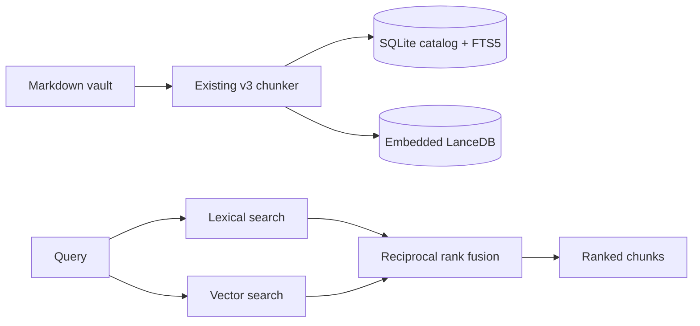

# ObsidianRAG Architecture

This document describes the high-level architecture of ObsidianRAG v3, which consists of a TypeScript plugin for Obsidian and a Python backend for RAG capabilities.

## High-Level Overview

```mermaid
graph TD
    User[User] -->|Interacts with| Plugin[Obsidian Plugin]
    Plugin -->|Spawns/Manages| Backend[Python Backend]
    Plugin -->|HTTP Requests| Backend
    Backend -->|Queries| VectorDB[(ChromaDB)]
    Backend -->|Inference| Ollama[Ollama LLM]
    Backend -->|Reads| Vault[Obsidian Vault]
```

## Component Interaction

### 1. Startup Flow

```mermaid
sequenceDiagram
    participant Obsidian
    participant Plugin
    participant Backend
    participant Ollama

    Obsidian->>Plugin: onload()
    Plugin->>Plugin: Load Settings
    Plugin->>Backend: Spawn Process (obsidianrag serve)
    loop Health Check
        Plugin->>Backend: GET /health
        Backend-->>Plugin: 200 OK
    end
    Plugin->>Ollama: GET /api/tags (Check Models)
    Ollama-->>Plugin: List of Models
    Plugin->>User: Ready (Status: Online)
```

### 2. RAG Query Flow (Streaming)

```mermaid
sequenceDiagram
    participant User
    participant Plugin
    participant Backend
    participant VectorDB
    participant Ollama

    User->>Plugin: Ask Question
    Plugin->>Backend: POST /ask/stream

    rect rgb(240, 248, 255)
        note right of Backend: Retrieval Phase
        Backend->>VectorDB: Query Embeddings
        VectorDB-->>Backend: Top K Chunks
        Backend->>Backend: Rerank Results
        Backend-->>Plugin: SSE: phase="rerank"
    end

    rect rgb(255, 250, 240)
        note right of Backend: Generation Phase
        Backend->>Ollama: Generate(Prompt + Context)
        loop Stream Tokens
            Ollama-->>Backend: Token
            Backend-->>Plugin: SSE: token="word"
        end
    end

    Backend-->>Plugin: SSE: done
    Plugin->>User: Display Full Answer
```

## Data Flow

```mermaid
flowchart LR
    subgraph "Obsidian Vault"
        MD[Markdown Files]
    end

    subgraph "Python Backend"
        Watcher[File Watcher]
        Chunker[Text Chunker]
        Embedder[Embedding Model]
        DB[(ChromaDB)]
    end

    MD --> Watcher
    Watcher -->|New/Modified| Chunker
    Chunker -->|Chunks| Embedder
    Embedder -->|Vectors| DB
```

## Retrieval Modernization

Hybrid retrieval currently keeps a small compatibility dependency on
`langchain_classic` for retriever composition and reranking adapters. New
retrieval work should follow the migration plan in
[LangChain Classic Migration Plan](langchain-classic-migration.md) and avoid
adding more `langchain_classic` surface area.

## Experimental v4 Vertical

The optional v4 vertical validates a framework-independent storage boundary without changing the production v3 API:

```mermaid
flowchart LR
    Vault[Markdown vault] --> Chunker[Existing v3 chunker]
    Chunker --> Catalog[(SQLite catalog + FTS5)]
    Chunker --> Vectors[(Embedded LanceDB)]
    Query[Query] --> FTS[Lexical search]
    Query --> Vector[Vector search]
    FTS --> RRF[Reciprocal rank fusion]
    Vector --> RRF
    RRF --> Results[Ranked chunks]
```

- SQLite is authoritative for chunk text, source paths, lexical search, note hashes, and index metadata.
- LanceDB is a rebuildable vector index keyed by deterministic chunk IDs.
- Builds scan vault Markdown directly and create an isolated copy-on-write revision. Unchanged chunks reuse their vectors; changed notes are split and embedded again; deleted notes are omitted.
- A build lock serializes writers. `active.json` changes only after SQLite integrity and exact chunk-ID agreement across the catalog, FTS5, and LanceDB have passed.
- Schema, embedding, or chunk-setting changes require `v4-index --full-rebuild`.
- Previous revisions remain available, so existing readers and rollback paths stay valid across activation.
- The experiment reuses the current chunker and embedding providers so retrieval storage can be compared without changing every variable at once.
- `obsidianrag evaluate --engine v3|v4` runs both implementations against the same expected-source dataset.

The v4 vertical remains optional and does not change the production v3 index or plugin routing.
