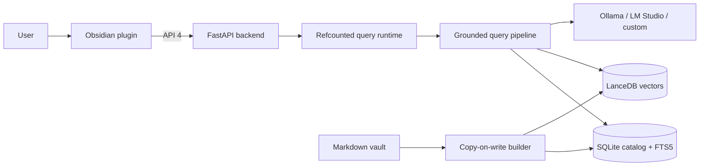
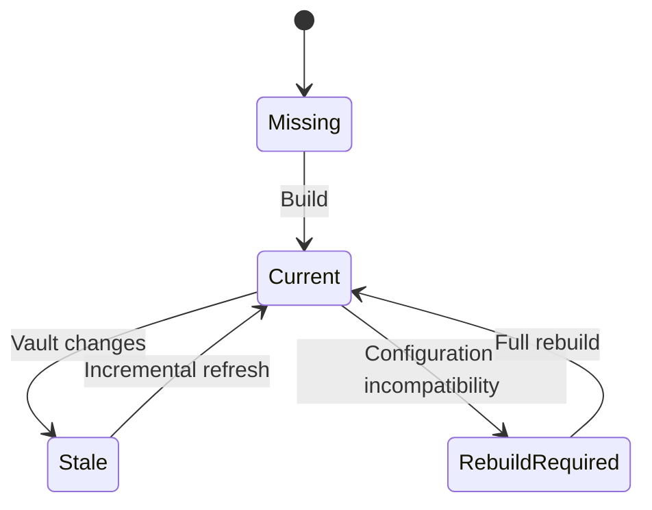

# ObsidianRAG 4 Architecture

ObsidianRAG 4 consists of a desktop-only Obsidian plugin and a local FastAPI backend. API 4 has one production retrieval engine: a revisioned SQLite FTS5 catalog plus embedded LanceDB vectors.

## Components

```mermaid
flowchart LR
    User --> Plugin[Obsidian plugin]
    Plugin -->|API 4| Server[FastAPI backend]
    Server --> Runtime[Refcounted query runtime]
    Runtime --> Pipeline[Grounded query pipeline]
    Pipeline --> SQLite[(SQLite catalog + FTS5)]
    Pipeline --> Lance[(LanceDB vectors)]
    Pipeline --> Provider[Ollama / LM Studio / custom]
    Vault[Markdown vault] --> Builder[Copy-on-write builder]
    Builder --> SQLite
    Builder --> Lance
```

## Startup

1. The plugin starts one configured backend executable with `shell:false`.
2. The plugin checks `/capabilities` and accepts only `api_version: 4`.
3. The backend inspects index status but never builds automatically.
4. If a compatible active revision exists, the backend opens a query pipeline and acquires its reader lease.
5. `/health` remains available even when `query_ready` is false.

## Index lifecycle

```mermaid
stateDiagram-v2
    [*] --> Missing
    Missing --> Current: Build
    Current --> Stale: Vault changes
    Stale --> Current: Incremental refresh
    Current --> RebuildRequired: Configuration incompatibility
    RebuildRequired --> Current: Full rebuild
```

The plugin maps these states to Build index, Refresh index, or Full rebuild. Pruning is always a separate explicit action.

### Revision build

- SQLite is authoritative for chunk text, note paths, content hashes, lexical search, and metadata.
- LanceDB is keyed by deterministic chunk IDs and can be rebuilt from the catalog plus embeddings.
- Builds scan regular Markdown without following links.
- Unchanged vectors are copied in bounded batches; changed notes are split and embedded again; deleted notes are omitted.
- Empty vaults produce valid empty revisions.
- Synthetic document/query probes bind metadata to the actual embedding vector space.
- Validation covers SQLite integrity and foreign keys, deterministic IDs, FTS semantics, path normalization, vector dimensions, and finite vector values.
- `active.json` changes only after the candidate is validated and synchronized.

### Reader lifecycle

Each retriever owns a filesystem lease for its revision. Query requests check out a refcounted pipeline slot. During refresh:

1. The old slot continues serving.
2. The builder activates a validated disk revision.
3. The server constructs a candidate pipeline bound to that exact revision.
4. The runtime atomically swaps slots.
5. The old pipeline closes only after all normal and streaming requests release it.

Cancellation-safe thread waits prevent a retriever from closing while blocking retrieval still runs. `prune` refuses to delete leased inactive revisions.

If disk activation succeeds but candidate construction fails, the old slot remains available. `/index/status` reports the active/serving mismatch as stale, and the next refresh reconciles it.

## API boundary

The stable v4 routes are:

- `/capabilities`
- `/health`
- `/models`
- `/ask`
- `/ask/stream`
- `/index/status`
- `/index/build`
- `/index/prune`

Operational errors use structured codes and do not expose internal paths.

## Configuration isolation

Each FastAPI application owns a copied `Settings` instance. A `ContextVar` override propagates it through request tasks and `asyncio.to_thread`, while CLI/library callers retain the process-global default. Creating an app does not create legacy database directories.

## Migration boundary

API 3 and the Chroma/LangGraph runtime were removed. Existing `.obsidianrag/db` data is ignored rather than imported or deleted. Compatible `.obsidianrag/v4` revisions remain reusable.
